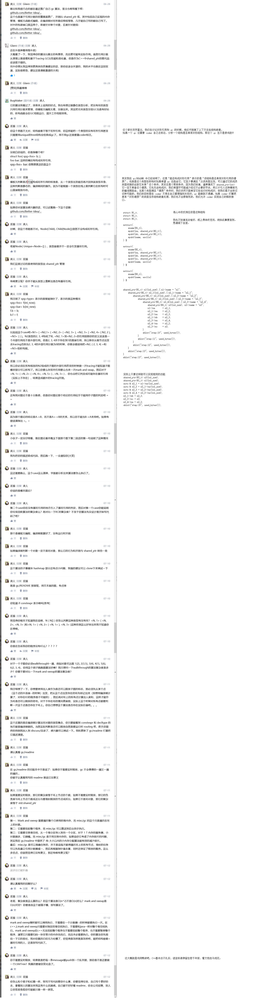

# 2020/11/27
“清华大学一学姐称被学弟性骚扰，并公开其身份信息至社交媒体后被证实是误会，她的行为是否欠妥？”  
故事会的开头大概是这样的，本来我不想吃这个瓜...  
学姐大概是被怒火冲昏了头脑，做出了不理智的决定，假如学弟这时秀一下学姐之前的套路，让学姐公开道歉，那学姐会不会觉得这个学弟脑子有问题呢？估计学姐还没“社会性死亡”，就直接当场去世了。  
都说做事留一面，日后好相见，但有些人我们见过就不想再见，希望 TA 最好从人间蒸发。也许事发时我们不冷静，但可以事后复盘一下，来探寻不安的根源在哪。  
我的故事发生几个月前，事情和技术相关，话题是关于 C++ GC 的探讨，虽然 C++ 标准中没有 GC，但不代表开发者不需要它，所以不乏有仁人志士自行研究 GC，
但在这过程中总会有人质疑乃至指指点点说三道四，**这大概就是当代在 B 乎上闲逛的程序员**。  

相关材料如下（非专业人员可跳过）：  
[README about C++ GC](https://github.com/Better-Idea/Mix-C/tree/master/gc)  
  
交(SI)流(BI)细(XIAN)节(CHAN)如下：  
- 看代码看不懂
- 看文档不仔细
- 举反例不实践
- 最后跟你扯复杂度高
- 简直辱没我猫家的名声，丢猫  

